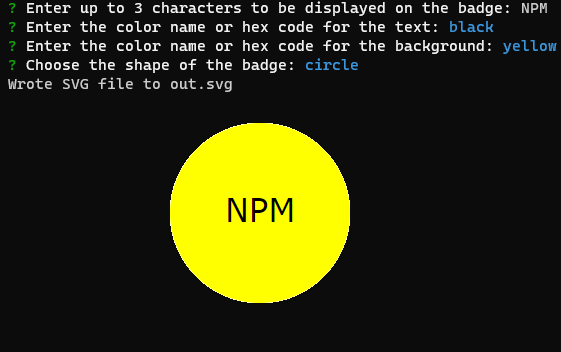

# SVG Logo Generator

[](https://opensource.org/licenses/MIT)

## Description

Generate an SVG logo based on some properties

## Table of Contents

* [Installation](#installation)
* [Usage](#usage)
* [License](#license)
* [Contributing](#contributing)
* [Tests](#tests)
* [Questions](#questions)

## Installation

Clone the repository code, and then run ```npm install``` in the root directory

## Usage

Run ```node injex.js``` in the root directory and answer the prompts.

Preview image:


A demonstration video can be found [here](https://drive.google.com/file/d/1bzxnWlj5XRhU4S-v4VQF2jbMlMLBRQhM/view?usp=sharing)

## License

This project uses the [MIT](https://opensource.org/licenses/MIT) license.

## Contributing

No contributions are accepted at this time.

## Tests

run ```npm test``` in the root directory to run tests

## Questions

If you have any questions, please contact me at [github@alexbi.shop](mailto:github@alexbi.shop).

You can also find me on [Github](https://github.com/alexbishopbootcamp).

